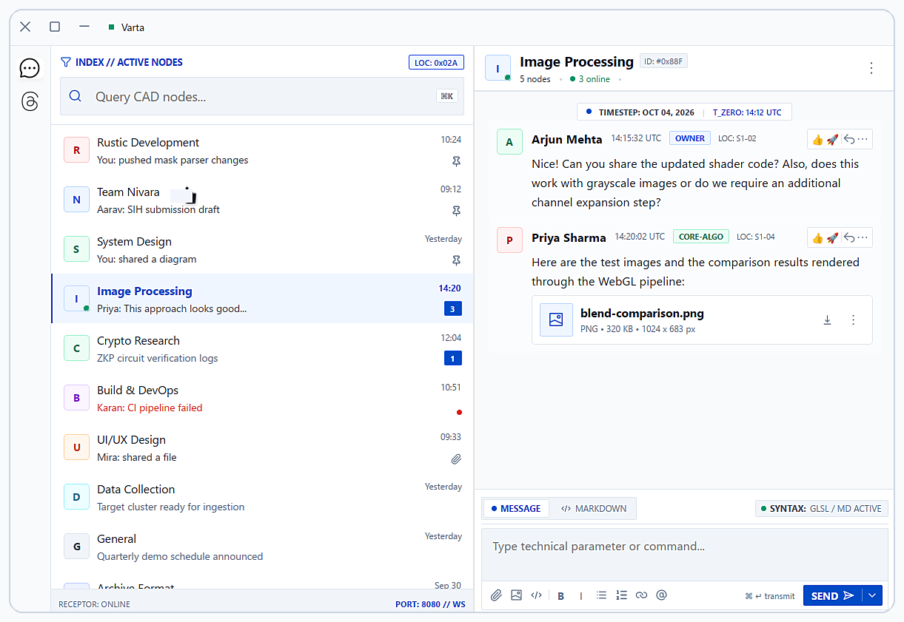
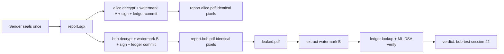

<p align="center">
  
</p>

# SageX — Broadcast-Encrypt, Individually-Decrypt with Tamper-Proof Forensic Attribution

<p>
  
  
  <sub>by Team Niv Ara · chat surface by Varta</sub>
</p>

    

> **One-liner:** Encrypt once, decrypt per-recipient — every decrypted copy looks identical but carries a unique invisible forensic watermark + tamper-proof signed ledger record.

**Prototype notice:** SageX is a hackathon/research prototype. APIs, capsule formats, and CLI flags are still stabilizing. Do not use for production secrets yet. See [Roadmap & gaps](#roadmap--known-gaps).


*`sagex-varta` chat workbench (Blueprint Precision theme): active-nodes index, WebGL pipeline thread, GLSL/Markdown composer.*

---

## TL;DR — what SageX proves

| Problem (`problem.txt`) | SageX answer |
|---|---|
| Same file to N recipients → leak is unattributable | Per-recipient **per-session invisible watermark** embedded **at decrypt time** |
| Access logs can be rewritten by an admin | Signed decrypt records on an **offline tamper-evident DLT** (no single-admin rewrite) |
| Static pre-distribution watermark is identical for all | Every copy **visually identical, forensically distinct** |
| Recipient can deny decrypting | Recipient signs the record with their **own NIST PQC private signing key** (non-repudiation) |
| Classical crypto won't survive PQC migration | **ML-KEM** for KEX + **ML-DSA** for signatures |
| Must work air-gapped | No cloud KMS, no public chain; all ops local/offline |

---

## PART A — Concise demo (judges, ~10 min)

### 1. Get started

```bash
# clone + offline check (one crate at a time, low-RAM per AGENTS.md)
git clone <repo-url> sagex && cd sagex
CARGO_NET_OFFLINE=true CARGO_BUILD_JOBS=1 cargo check -p sagex-crypto

# key generation (PQC identity per recipient)
cargo run -p sagex-keys --bin sagex-keys -- keygen --user alice-test --out ./env/keys

# start offline ledger node (tamper-evident DLT, local only)
cargo run -p sagex-nodeblock -- --config ./nodeblock.toml.example

# launch chat workbench (optional UI)
cargo run -p sagex-varta
```

> Offline note: everything runs air-gapped — crypto, identity, watermark, ledger, verification need no cloud KMS or public blockchain. Copy the repo + vendored deps onto the offline machine once.

### 2. Full leak-attribution demo

```bash
# 1. sender encrypts once for the group
sagex-capsule seal --in report.pdf --out report.sgx --for alice-test,bob-test

# 2. each recipient decrypts independently (watermark embedded at this moment)
sagex-capsule open --in report.sgx --as alice-test --out report.alice.pdf
sagex-capsule open --in report.sgx --as bob-test   --out report.bob.pdf
# both PDFs look pixel-identical

# 3. simulate a leak: someone posts report.bob.pdf publicly
cp report.bob.pdf leaked.pdf

# 4. extract watermark + attribute via ledger
sagex-l1wm extract --in leaked.pdf
sagex-nodeblock lookup --watermark <extracted-id> --verify
```

**Expected output:**

```
watermark: wm:bob-test:9f3a…c1  (session #42)
ledger:    block 118, tx 7 — signed by bob-test (ML-DSA verify OK)
record:    bob-test decrypted report.sgx at 2026-…Z, capsule sha256:abc…
attribution: cryptographically verified → bob-test, session #42
```



---

## PART B — Formal technical reference

### Architecture

```text
sagex-keys ─┐
sagex-crypto ├─► sagex-capsule (seal/open + watermark hook) ─► sagex-l1wm (embed/extract)
            │                                                     │
sagex-authsrv (identity)                                   sagex-nodeblock (offline DLT)
            │                                                     │
sagex-chatsrv / sagex-varta (Blueprint Chat UI) ◄── lookup + verify ─┘
sagex-archive / sagex-archlib / sagex-csrfmt / sagex-nodeblock-store (support, formats, storage)
```

### End-to-end workflow (maps to `problem.txt` §End-to-End)
1. Sender seals document → broadcast capsule.
2. Recipient opens capsule with own credentials.
3. System generates unique invisible watermark bound to (recipient, session).
4. Recipient signs decrypt record with own **ML-DSA** private key.
5. Signed record committed to offline DLT.
6. Recipient gets fingerprinted copy (identical rendering).
7–10. On leak: extract watermark → ledger lookup → signature + chain verification → verifiable attribution record.

### Watermark (deep dive)
- **When:** strictly at decrypt time, never pre-distribution.
- **Binding:** `watermark_id = f(recipient_id, session_nonce, capsule_hash)`; extractor recovers the ID robustly from the leaked copy.
- **Property:** visually identical (PSNR-gated, pixel-perfect layout), forensically distinct (per-copy payload survives the supported transforms; see failure modes).
- Code: `crates/sagex-l1wm`, hook in `sagex-capsule` open path.

### Crypto (PQC)
| Function | Algorithm (NIST PQC) | Crate |
|---|---|---|
| Key exchange / recipient wrap | **ML-KEM** | `sagex-crypto`, `sagex-keys` |
| Decrypt-record signatures | **ML-DSA** (recipient private key) | `sagex-keys`, `sagex-nodeblock` verify |
| Bulk content encryption | AES-GCM (with PQC-wrapped keys) | `sagex-crypto/src/aes.rs` |
| Capsule format | sealed blob + recipient wraps + policy | `sagex-capsule` |

**Non-repudiation flow:** open → watermark → build record `{wm_id, capsule_hash, recipient, timestamp}` → sign with recipient ML-DSA key → submit to DLT → DLT returns block/tx receipt → receipt stored alongside copy.

**Key lifecycle (`sagex-keys`):** `keygen` (ML-KEM + ML-DSA pairs, offline) → local storage (no cloud KMS) → rotation via new keygen + ledger key-update record → revocation list checked at open time.

### Ledger / DLT (deep dive)
- **What:** `sagex-nodeblock` — offline, tamper-evident, append-only chain; HTTP API for submit/lookup (`src/http.rs`, `store.rs`, `consensus.rs`, `model.rs`).
- **Why tamper-proof:** hash-linked blocks + multi-writer consensus config; no single admin key can rewrite/delete history. Verification replays chain hashes + ML-DSA signatures.
- **Offline:** runs fully air-gapped; config via TOML (`nodeblock.toml.example` pattern).

### Capsule format (`sagex-capsule`)
Sealed envelope: header (version, policy, recipient list) + ML-KEM-wrapped content keys per recipient + AES-GCM ciphertext + integrity tag. `open` enforces policy, unwraps with recipient KEM key, embeds watermark, then emits signed ledger record.

### Crates

| Crate | Role |
|---|---|
| `sagex-crypto` | PQC + AES primitives (`aes.rs`, `lib.rs`) |
| `sagex-keys` | PQC identity/keygen/storage |
| `sagex-capsule` | seal/open envelope + watermark hook |
| `sagex-l1wm` | watermark embed/extract (`lib.rs`, `main.rs`) |
| `sagex-nodeblock` | offline DLT node + HTTP + consensus |
| `sagex-authsrv` | identity/auth service |
| `sagex-chatsrv` | chat relay service |
| `sagex-varta` | Blueprint Chat desktop workbench (UI) |
| `sagex-archive` | archive binary/service |
| `sagex-archlib` | shared archive library |
| `sagex-csrfmt` | format helpers |
| `sagex-test` | test vectors/harness |

### Repo map
```text
problem.txt requirement.md DESIGN.md Cargo.toml
crates/<each of the 12 crates above>/src/...
stitch_pixel_perfect_chat_layout (1)/  # UI reference mock
office.hexpat zip.hexpat mkenv docker-compose.yml
docs/screenshots/sagex-varta.png  # add this capture
```

### Requirements traceability (`problem.txt`)
| # | Requirement | Where |
|---|---|---|
| 1–3 | unique invisible per-recipient per-session watermark; identical yet distinct | `sagex-l1wm`, capsule open hook, Part A demo |
| 4–5 | bind event to identity via recipient private-key signature | `sagex-keys` + signing flow |
| 6 | NIST PQC for KEX + signatures | ML-KEM / ML-DSA, `sagex-crypto` |
| 7–8 | DLT, no single-admin rewrite | `sagex-nodeblock` |
| 9–11 | extract → lookup → verified attribution | `sagex-l1wm extract`, nodeblock lookup |
| 12–14 | offline, no cloud KMS, no public chain | air-gapped design |

### Threat model
- **Malicious admin:** cannot backdate/erase decrypt records (append-only hash chain + consensus); worst case is denial-of-service, not forgery.
- **Denying recipient:** ML-DSA signature with their own key → non-repudiation (assuming private key not shared — see failure modes).
- **Colluding recipients:** comparing copies may reveal watermark locations; per-session nonces limit cross-session linkage.
- **Stolen copy without watermark path:** attribution only works if leaked copy retains extractable watermark.

### Failure modes / limitations
- Heavy re-typing, screenshots with aggressive downscaling, or format conversion may destroy the watermark → extraction fails closed (no false attribution).
- Key loss = identity loss (no cloud recovery by design); key sharing breaks non-repudiation.
- Ledger needs quorum/retention policy; a fully wiped offline cluster loses availability (integrity of surviving copies still verifiable).

### Roadmap / known gaps
- [ ] Robustness testing across PDF/image/video transforms
- [ ] Formal watermark capacity/PSNR benchmarks
- [ ] Key revocation UX + hardware-backed storage
- [ ] Multi-node consensus hardening + snapshot sync
- [ ] Replace screenshot placeholder with real `sagex-varta` capture

### Judging-criteria mapping
| Criterion | Evidence |
|---|---|
| Correctness | Part A demo output + `problem.txt` traceability |
| Innovation (PQC + forensics) | decrypt-time watermark × ML-KEM/ML-DSA × offline DLT |
| Completeness | seal → open → sign → commit → extract → verify loop |
| Offline deployment | air-gapped, no KMS/public chain |

### FAQ
**Q: Why not server logs?** Rewritable by privileged admins; ledger is append-only.
**Q: Why not pre-distribution watermarks?** Identical across recipients → same attribution problem.
**Q: Does PQC slow things down?** KEX/signing are one-time per session; bulk stays AES-GCM.
**Q: What if the leak is a photo of the screen?** Out of scope — failure mode above; extraction reports confidence.

### Who made this

Built by Team Niv Ara. SageX is the solution — the logo up top is the project mark (`sagex.svg`, copy under `docs/assets/`). The chat UI in the screenshots is Varta, the workbench the demo runs through; the small icons next to the title are the team mark (`logo copy.svg`) and the app mark (`varta.svg`).

### License and contributing

No license file is in the repo yet — if you're judging this, treat it as all-rights-reserved for now. If we open-source it we'll go with MIT or Apache-2.0. For contributions, check one crate at a time (`cargo check -p <crate>`), keep tests in each crate's `tests/` folder, and don't commit real keys or environment data.

---

*Spec: `problem.txt`. Design: `DESIGN.md`. PRD/UI: `requirement.md`.*
